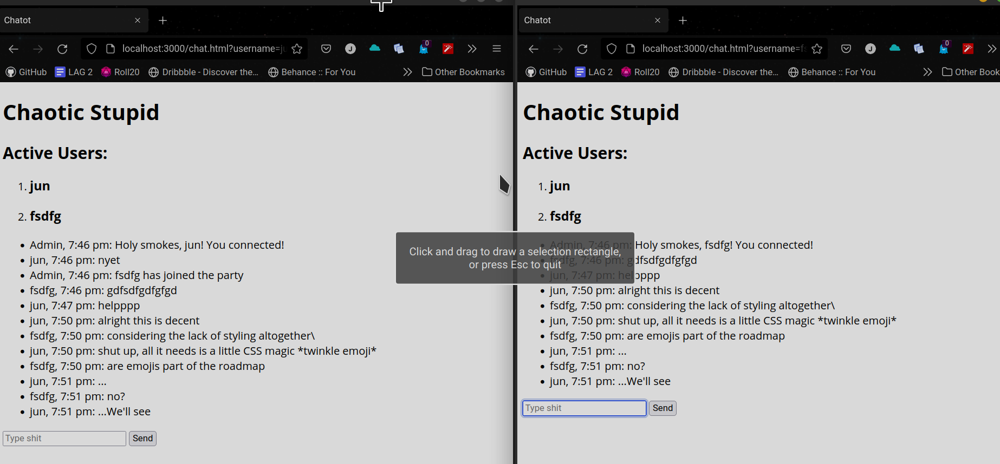

# unnamedChatApp
A chat app built with express, socket.io, node.js and keeping my eyes open too long
## I am aware it is ugly
...and that it probably doesn't work on anyone else's machine out of the box.

Might have to do with the fact that it needs a server to live and feed off of.
## But this is for practice.
- Uses multiple node modules 
  - express (for hosting and general node framework malarkey)
  - socket.io (without which none of these sockets things would've been possible)
  - moment (for its *timeless* contributions)
  - nodemon (for making me much less frustrated. Imagine if I had to restart the server manually *every* time. Yeesh.)
- Forms (It's not very exciting but I didn't do anything with this in the previous one)
- Precursor to something bigger. (I know, ominous)
## Next Up
- CSS 
- Room Extras
  - Create Rooms
  - Delete Rooms
  - Direct messages
- Saving users
- Dice roller
- Possibly hosting it elsewhere (Firebase?)
